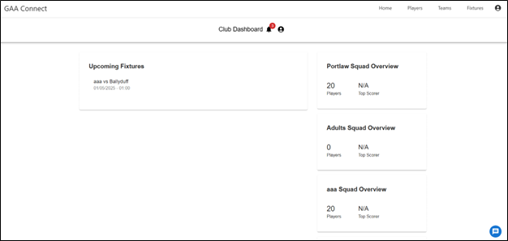
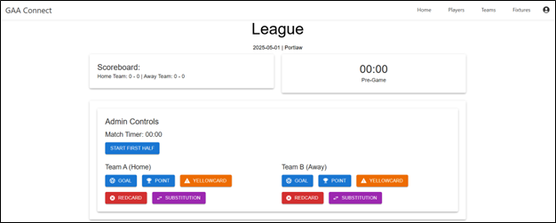
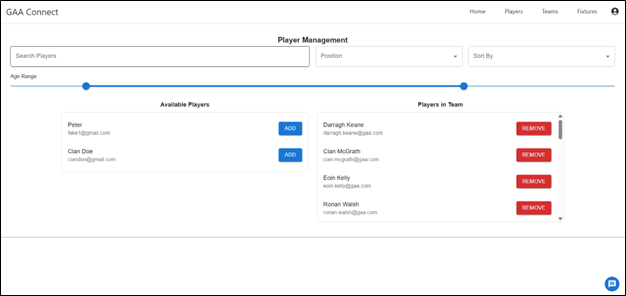
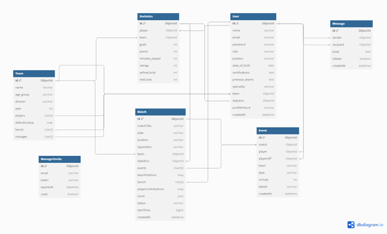
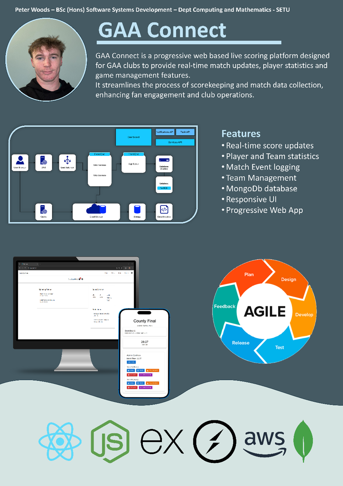

# GAA Connect

GAA Connect is a full-stack Progressive Web Application (PWA) designed to centralise all the needs of GAA clubs. The system supports various user roles including players, managers, administrators, and fans. Enhancing engagement and performance at all levels of the sport.

## 📌 Project Overview

This project was developed as part of a final year project for Software Systems Development. It advances clubs with tools for match-day tracking, player stats, live scoring, and more. Built with scalability and accessibility in mind.

## 🚀 Features

### ✅ Core Functionality
- **Role-Based Access:** Managers, Players, Admins, Fans
- **Player & Team Management:** Line-ups, Player Management, stats
- **Live Match Day Scoring:** Real-time tracking of events, substitutions, and scores
- **Fixture & Calendar Management:** Calendar for Matches
- **In-App Notifications:** Confirmations, Messages etc.
- **Secure Authentication:** Single User schema with role permissions
- **Chat System:** Player ↔ Coach, Team ↔ Admin
- **Offline Mode:** Full functionality even without internet (PWA advantage)

### 🔜 Potential Future Features
- Payment integration via Stripe/PayPal
- Social media integration (auto-tweeting, updates)
- Analytics dashboards and performance leaderboards
- Full live trial with a local GAA club
- Multi-language support

## 🛠️ Tech Stack

| Layer         | Technology                       |
|--------------|----------------------------------|
| Frontend     | React.js, Material UI            |
| Backend      | Node.js, Express.js, OAuth2      |
| Database     | MongoDB Mongoose & Atlas         |
| Real-Time    | Socket.io                        |
| Testing      | Jest, Supertest                  |
| DevOps       | Docker, AWS (EC2, S3, IAM)       |
| Auth         | JWT, OAuth2                      |
| UI/UX        | React Toastify, Tailwind CSS     |

## 📱 Progressive Web App

- Add to homescreen
- Works offline for match tracking
- Service worker caching
- Auto-updates without user intervention

## 🧪 Testing

Basic backend testing using **Jest** and **Supertest**. Covers:
- User registration
- Login
- Role-based access control
- CRUD operations for key entities

## 📸 Screenshots

| Feature                | Screenshot                  |
|------------------------|-----------------------------|
| Home Page              |   |
| Match Day Scoring      |  |
| Player Management      |  |
| Final ER Diagram       |  |
| Poster                 |  |


## 🛠️ Installation

### 1. Clone the Repository

```
git clone https://github.com/PeterWoods02/GaaConnect.git
cd GaaConnect
```

### 2. Install Backend Dependencies

Navigate into the **backend** directory:

```
cd backend
```

Then, install dependencies for the **backend**:

```
npm install
```


### 3. Install Frontend Dependencies

Navigate into the **frontend** directory:

```
cd frontend
```

Then, install dependencies for the **frontend** (React):

```
npm install
```

### 4. Configure Environment Variables

Create `.env` files in both the backend directory and the frontend directory with the necessary environment variables.

For the **backend**, the `.env` file may look like this:

```
MONGO_URI=your_mongodb_connection_string
JWT_SECRET=your_jwt_secret
PORT=5000
```

For the **frontend**, the `.env` file may look like this:
Changes may also need to be made to **/API**

```
REACT_APP_API_URL=http://localhost:5000
```

### 5. Run the Development Servers

Now, you need to run both the **frontend** and **backend** servers in separate terminal windows.

1. **Run the Backend Server**:

Open a terminal in the backend folder and run:

```
npm run dev
```

This will start the backend (Node.js/Express) server.

2. **Run the Frontend Server** (React):

Open another terminal in the `frontend` folder and run:

```
npm start
```

This will start the frontend (React) development server.

Now you can interact with both servers during development. The backend will be running at `http://localhost:5000`, and the frontend will be running at `http://localhost:3000`.

---
## 🌍 Deployment

- Deployed on **AWS EC2**
- Dockerised containers for backend and frontend
- S3 + CloudFront for static file serving
- Domain & HTTPS handled via AWS Route53 and CloudFront


## 📅 Development Approach

- Agile methodology with weekly sprints
- Task tracking via Trello
- Wireframes, ER diagrams, and user stories
- GitHub for source control with regular commits and documentation

## 📄 Licence

MIT License

## 👨‍💻 Author

**Peter Woods**  
Software Systems Development  
Student ID: 20098630  
Supervisor: Mary Lyng  
[Project Repo](https://github.com/PeterWoods02/GaaConnect)


